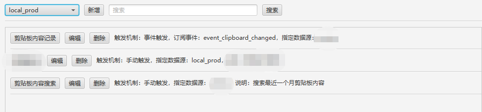
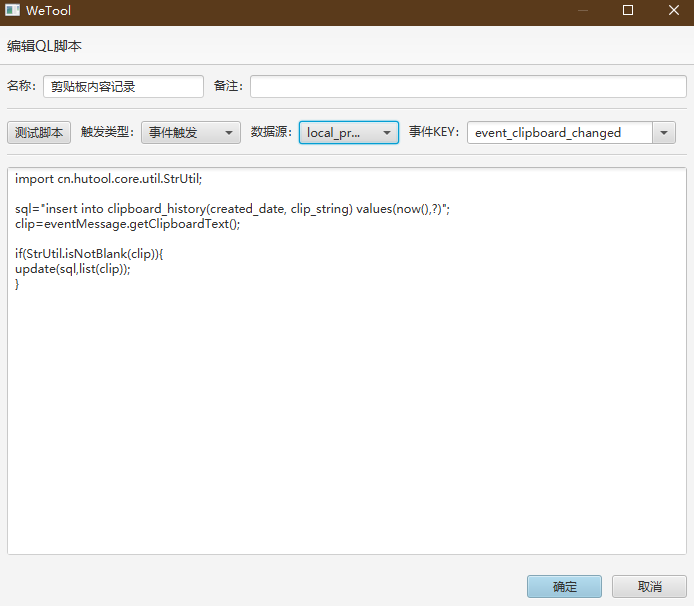
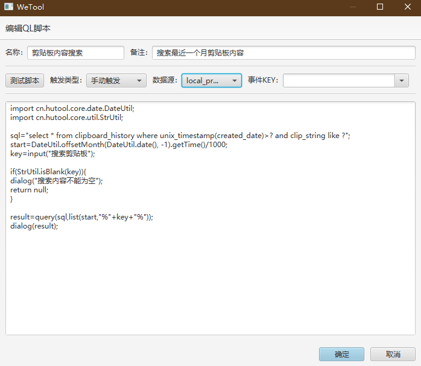
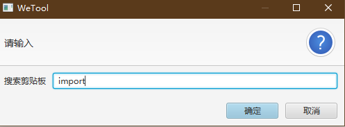
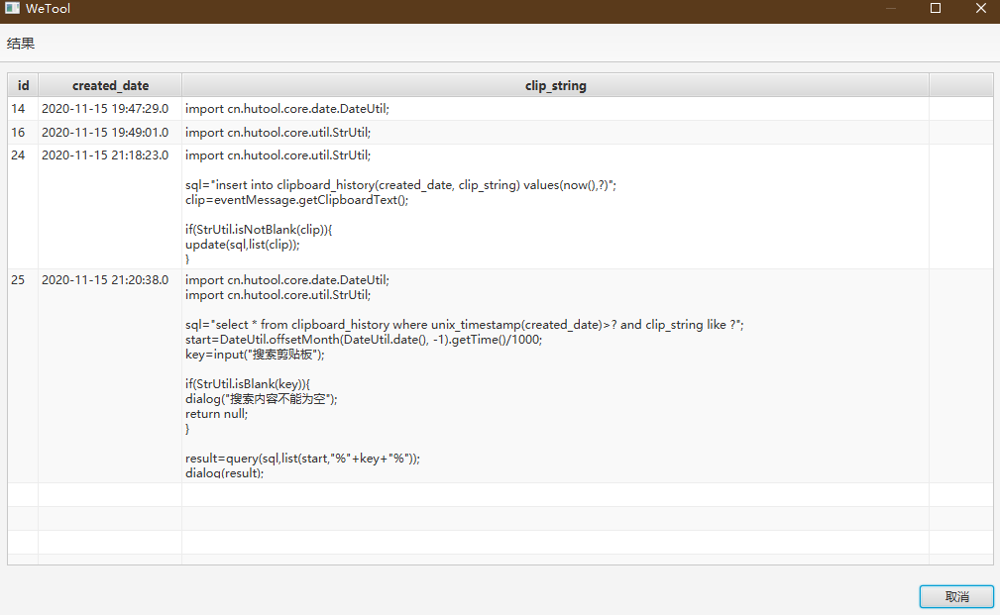

## Ease DB Ops

dbops，中文名为数据库小应用，那这是干嘛用的？我们将一系列的脚本封装成一个小应用，程序会将这个小应用可视化为一个按钮，只需点击一下即可执行脚本。

为什么叫数据库小应用？因为原本这款插件就是为了将一系列SQL操作封装成小应用而设计的，而考虑到执行这一系列的SQL可能会用到参数的注入，变量的定义，绑定方法，那这一系列操作肯定会绕道脚本的执行上去，那自然就不仅限于SQL了，只要符合语法的脚本都是可以执行的。

最新版下载地址：[wetool-plugin-dbops]()

> 本插件使用的脚本解析库 [QLExpress](https://github.com/alibaba/QLExpress), 语法基本和java一致，几乎没有学习成本，了解语法点击链接即可。

### 运行截图



### 内置方法

|方法|返回类型|说明|
|---|---|---|
|dialog(Object object)|void|弹窗|
|list(Object... params)|List\<Object\>|将数组转成List|
|input(String tip)|String|输入框弹窗，参数为提示内容|
|log(String msg, Object... params)|void|打印日志，参数与slf4j的log.info保持一致|
|format(String str, Object... params)|String|格式化字符串，与hutool的StrUtil.format保持一致|
|query(String sql, List params)|List\<Map\<String, Object\>\>|执行SQL查询语句，需连接数据库|
|update(String sql, List params)|long|执行SQL更新语句，需连接数据库，返回影响的行数|

### 事件订阅

目前脚本支持两种触发方式：手动执行，以及事件订阅。[查看有哪些事件？](../../wetool-plugin-support/readme.md)，如果需要用到事件的消息作为参数，可能需要查看源代码，[查看目录](../../wetool-plugin-support/src/main/java/org/code4everything/wetool/plugin/support/event/message)。

事件发布的消息会随一个被定义为 `eventMessage` 的变量一起注入到脚本中。

### 两个小例子

将剪贴板内容保存到数据库中，并添加一个查询小应用。

首先，我们需要创建用于存储剪贴板内容的数据表

```sql
create table clipboard_history (
    id bigint auto_increment not null primary key,
    created_date datetime not null,
    clip_string text not null
) comment '剪贴板历史';

create index clipboard_history_date_index on clipboard_history (created_date desc);
```

监听剪贴板事件，并保存至数据库



```java
import cn.hutool.core.util.StrUtil;

sql="insert into clipboard_history(created_date, clip_string) values(now(),?)";
clip=eventMessage.getClipboardText();

if(StrUtil.isNotBlank(clip)){
update(sql,list(clip));
}
```

最后新增一个查询最近一个月剪贴板内容的小应用



```java
import cn.hutool.core.date.DateUtil;
import cn.hutool.core.util.StrUtil;

sql="select * from clipboard_history where unix_timestamp(created_date)>? and clip_string like ?";
start=DateUtil.offsetMonth(DateUtil.date(), -1).getTime()/1000;
key=input("搜索剪贴板");

if(StrUtil.isBlank(key)){
dialog("搜索内容不能为空");
return null;
}

result=query(sql,list(start,"%"+key+"%"));
dialog(result);
```

> 这里注意有个小坑：使用return结束执行时一定要有返回值，否则语法会报错。

效果





### 更新历史

#### [v1.2.0]()

- 支持订阅事件
- 支持QLExpress脚本
- 支持SQL执行
