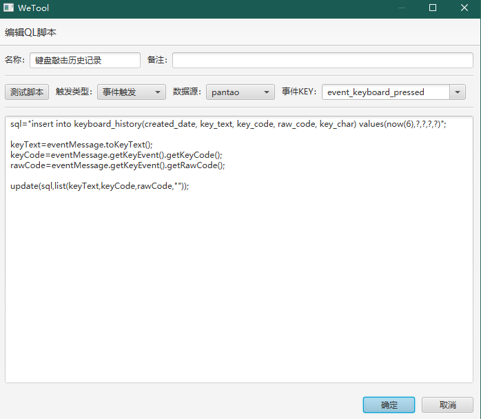
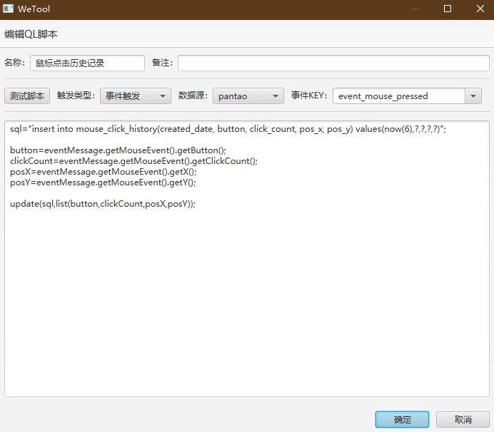

## Ease DB Ops

dbops，中文名为数据库小应用，我们可以将一系列的脚本封装成一个小应用，程序会将这个小应用可视化为一个按钮，只需点击一下即可执行脚本。

为什么叫数据库小应用？因为原本这款插件是为了将一系列SQL操作封装成小应用而设计的，而考虑到执行这一系列的SQL可能会用到参数的注入，变量的定义，绑定方法，那这一系列操作肯定会绕到脚本的执行上去，那自然就不仅限于SQL了，只要符合语法的脚本都是能够被执行的。

最新版下载地址：[wetool-plugin-dbops](http://share.qiniu.easepan.xyz/tool/wetool/plugin/wetool-plugin-dbops-1.3.0.jar)

> 如需配置数据库，[请点击此处查看](https://gitee.com/code4everything/wetool) 。本插件使用的脚本解析库 [QLExpress](https://github.com/alibaba/QLExpress), 语法基本和java一致，几乎没有学习成本，了解语法点击链接即可。

### 运行截图


### 自动导包

程序自动导入以下类

```java
import java.lang.*;
import java.util.*;

import org.code4everything.wetool.plugin.support.util.*;
import org.code4everything.wetool.plugin.support.factory.*;
import org.code4everything.wetool.plugin.support.http.*;
import org.code4everything.wetool.plugin.support.event.*;
import org.code4everything.wetool.plugin.support.druid.*;

import com.alibaba.fastjson.*;

import cn.hutool.core.util.*;
import cn.hutool.core.collection.*;
import cn.hutool.core.date.*;
import cn.hutool.core.io.*;
import cn.hutool.core.lang.*;
import cn.hutool.core.map.*;
```

### 内置方法

|方法|返回类型|说明|
|---|---|---|
|dialog(Object object)|void|弹窗|
|list(Object... params)|List\<Object\>|将数组转成List|
|input(String tip)|String|输入框弹窗，参数为提示内容|
|log(String msg, Object... params)|void|打印日志，参数与slf4j的log.info保持一致|
|format(String str, Object... params)|String|格式化字符串，与hutool的StrUtil.format保持一致|
|query(String sql, List params)|List\<Map\<String, Object\>\>|执行SQL查询语句，需连接数据库|
|update(String sql, List params)|long|执行SQL更新语句，需连接数据库，返回影响的行数|
|processes(String name)|List\<OSProcess\>|模糊匹配进程名称|
|run(String... cmds)|String|执行命令，返回执行结果|
|put(String key, Object value)|void|设置局部变量，可传递到子脚本中|
|global(String key, Object value)|void|声明全局变量，自动注入到脚本中|
|exec(String key)|Object|执行脚本，参数为全局变量名称，脚本内容取全局变量对应的值，返回执行结果|
|http0(String api, String varKey)|boolean|暴露http服务，api格式：get/api/hello，varKey为回调脚本（子脚本）的名称|
|http1(int port, String api, String varKey)|boolean|暴露http服务|
|pushThisEvent2Remote(String postApi)|void|推送当前事件到远程|

### 内置变量

|变量名|类型|说明|
|---|---|---|
|now|Date|触发脚本执行的时间|
|dbName|String|脚本当前执行的dbName|

### 事件订阅

目前脚本支持两种触发方式：手动执行，以及事件订阅。[查看有哪些事件？](../../wetool-plugin-support/readme.md)，如果需要用到事件的消息作为参数，可能需要查看源代码，[查看目录](../../wetool-plugin-support/src/main/java/org/code4everything/wetool/plugin/support/event/message)。

事件发布的消息会随一个被定义为 `eventMessage` 的变量一起注入到脚本中，同时还会注入 `eventKey` `eventTime` 属性。

### 远程事件的推送与发布

### 例子1：存储剪贴板历史并添加查询按钮

首先，我们需要创建用于存储剪贴板内容的数据表

```sql
create table clipboard_history (
    id bigint auto_increment not null primary key,
    created_date datetime(6) not null,
    clip_string text not null
) comment '剪贴板历史';

create index clipboard_history_date_index on clipboard_history (created_date desc);
```

监听剪贴板事件，并保存至数据库


```java
import cn.hutool.core.util.StrUtil;

sql="insert into clipboard_history(created_date, clip_string) values(now(6),?)";
clip=eventMessage.getClipboardText();

if(StrUtil.isNotBlank(clip)){
update(sql,list(clip));
}
```

最后新增一个查询最近一个月剪贴板内容的小应用


```java
import cn.hutool.core.date.DateUtil;
import cn.hutool.core.util.StrUtil;

sql="select * from clipboard_history where unix_timestamp(created_date)>? and clip_string like ?";
start=DateUtil.offsetMonth(DateUtil.date(), -1).getTime()/1000;
key=input("搜索剪贴板");

if(StrUtil.isBlank(key)){
dialog("搜索内容不能为空");
return null;
}

result=query(sql,list(start,"%"+key+"%"));
dialog(result);
```

> 这里注意有个小坑：使用return结束执行时一定要有返回值，否则语法会报错。


### 例子2：保存键盘敲击记录

创建表结构

```sql
create table keyboard_history (
    id bigint auto_increment primary key,
    created_date datetime(6) not null,
    key_text varchar(32) not null,
    key_code int not null,
    raw_code int not null
) comment '键盘敲击历史记录';

create index keyboard_history_key_code_index on keyboard_history (key_code);
create index keyboard_history_key_text_index on keyboard_history (key_text);
```

添加存储脚本



```java
sql="insert into keyboard_history(created_date, key_text, key_code, raw_code) values(now(6),?,?,?)";

keyText=eventMessage.toKeyText();
keyCode=eventMessage.getKeyEvent().getKeyCode();
rawCode=eventMessage.getKeyEvent().getRawCode();

update(sql,list(keyText,keyCode,rawCode));
```

大功告成，任何键盘敲击行为都会记录到数据库，我们可以根据这些数据来分析我们每天的活动行为。

### 例子3：鼠标点击记录

创建数据表结构

```sql
create table mouse_click_history (
    id bigint auto_increment not null primary key,
    created_date datetime(6) not null,
    button int not null,
    click_count int not null,
    pos_x int not null,
    pos_y int not null
) comment '鼠标点击历史记录';
```

添加存储脚本



```java
sql="insert into mouse_click_history(created_date, button, click_count, pos_x, pos_y) values(now(6),?,?,?,?)";

button=eventMessage.getMouseEvent().getButton();
clickCount=eventMessage.getMouseEvent().getClickCount();
posX=eventMessage.getMouseEvent().getX();
posY=eventMessage.getMouseEvent().getY();

update(sql,list(button,clickCount,posX,posY));
```

### 更新历史

#### [v1.3.0](http://share.qiniu.easepan.xyz/tool/wetool/plugin/wetool-plugin-dbops-1.3.0.jar)

- 支持导入导出
- 修复了一些已知问题
- 支持子脚本
- 支持暴露http服务

#### [v1.2.0](http://share.qiniu.easepan.xyz/tool/wetool/plugin/wetool-plugin-dbops-1.2.0.jar)

- 支持订阅事件
- 支持QLExpress脚本
- 支持SQL执行
