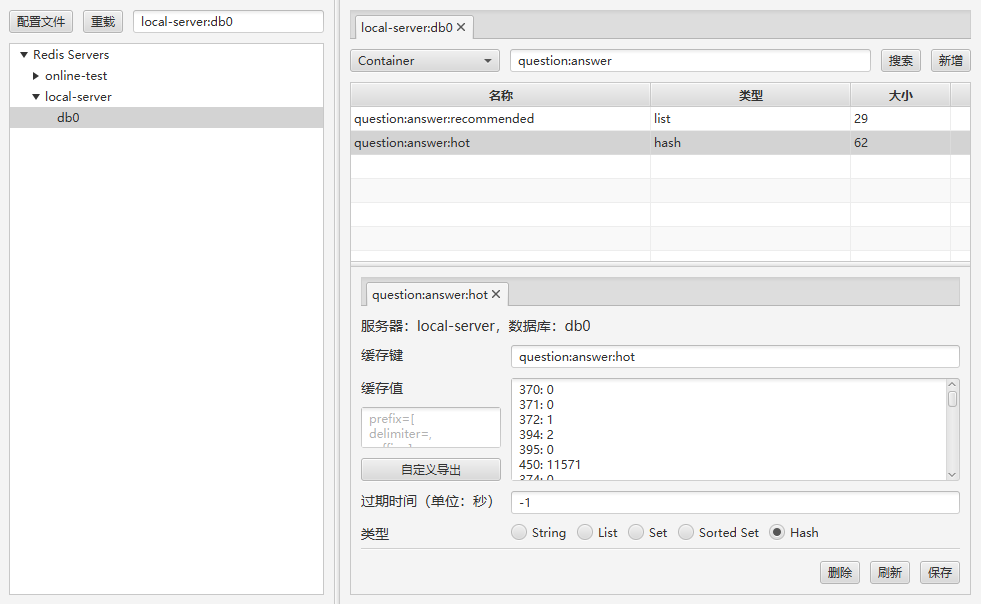
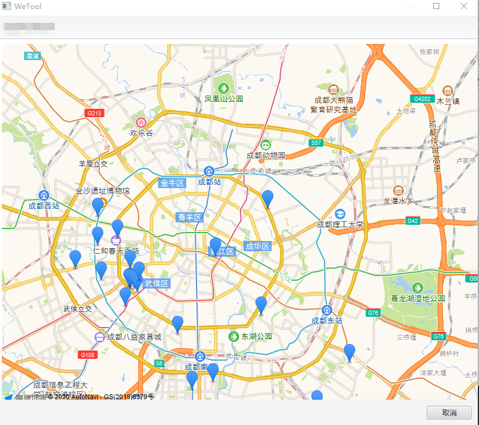
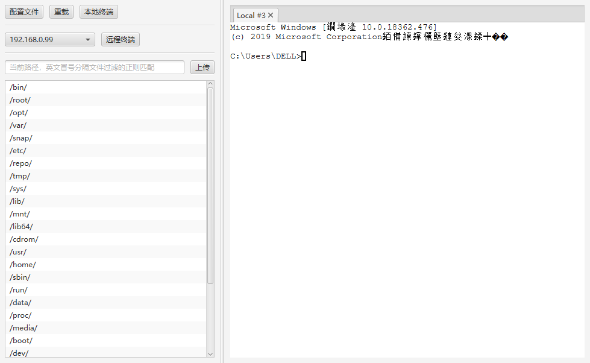

### 开发工具

最新下载地址：[wetool-plugin-devtool-1.1.1.zip](http://share.qiniu.segocat.com/tool/wetool/plugin/wetool-plugin-devtool-1.1.1.zip)

#### 1. Java工具


#### 2. Redis客户端

配置文件

```json5
{
    "servers": [
        {
            /*全局唯一，为空时使用host作为别名*/
            "alias": "",
            "host": "localserver",
            "port": 6379,
            "password": "",
            "initialConnect": true,
            "dbs": [
                0
            ]
        }
    ]
}
```



`Redis Geo`地图



### 3. SFTP-SSH工具

配置文件

```json5
{
    /*终端默认路径*/
    "defaultConsolePath": null,
    "servers": [
        {
            /*全局唯一，为空时使用host作为别名*/
            "alias": "",
            "host": "localserver",
            "port": 22,
            "username": "root",
            "password": "root",
            "charset": "utf-8"
        }
    ]
}
```



### 更新历史

#### [v1.1.2](http://share.qiniu.segocat.com/tool/wetool/plugin/wetool-plugin-devtool-1.1.2.zip)

- Redis支持打开GEO地图

#### [v1.1.1](http://share.qiniu.segocat.com/tool/wetool/plugin/wetool-plugin-devtool-1.1.1.zip)

- 更新WeTool版本
- 修复redis导出格式错误的bug

#### [v1.1.0](http://share.qiniu.segocat.com/tool/wetool/plugin/wetool-plugin-devtool-1.1.0.zip)

- 更新WeTool版本

#### [v1.0.2](http://share.qiniu.segocat.com/tool/wetool/plugin/wetool-plugin-devtool-1.0.2.zip)

Java

- 支持javap反汇编命令
- 支持SpringExpression表达式解析
- 支持JS执行

Redis

- 支持Key精确与模糊查询
- 支持String、List、Set、SortedSet、Hash的增删改查
- 支持自定义格式导出Value
- 支持设置过期时间

SFTP-SSH

- 支持通过SSH查看、上传、下载、删除文件
- JavaFX终端支持

Utilities

- 支持时间戳与时间的相互转换
