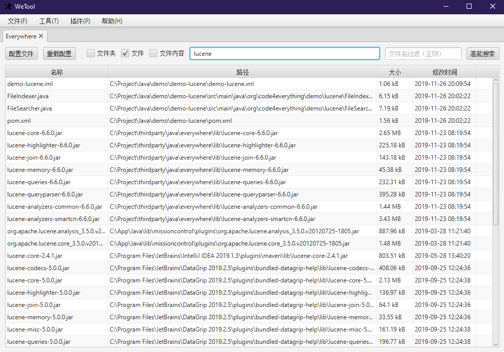

### Everywhere For WeTool

基于ApacheLucene搜索框架实现的文件检索工具，通过Lucene语法可搜索路径，文件名，部分文件内容（需配置）

配置说明如下：

```json
{
    /*不创建内容索引的文件正则表达式*/
    "excludePatterns": [
        "^C:\\\\Windows",
        "^C:\\\\ProgramData",
        "^C:\\\\Program Files",
        "^C:\\\\PerfLogs"
    ],
    /*是否忽略隐藏的文件*/
    "ignoreHiddenFile": true,
    /*创建内容索引的文件正则表达式*/
    "includePatterns": [
        "java$",
        "xml$",
        "json$"
    ],
    /*内容索引的文件最大大小，超过该大小的文件不会创建内容索引，单位：字节*/
    "sizeLimit": "100,000",
    /*是否创建文件内容索引（全局）*/
    "indexContent": true,
    /*重新创建索引的搜索间隔时间，当两次搜索间隔超过该设置时就重新创建索引，单位：分钟*/
    "reindexExpireBetweenSearch": 1440
}
```

### 运行截图



### Lucene常用语法

|符号|说明|示例|
|---|---|---|
|?|匹配单个任意字符|te?t|
|*|匹配多个任意字符|t*t|
|~|模糊匹配|test~|
|^|权重，越大说明相关度越高|test^10|

目前Lucene用到的特殊字符`+ – && || ! ( ) { } [ ] ^ ” ~ * ? : /`，搜索特殊字符时，需要`/`进行转义，例如：`()/` => `/(/)//`

> [Lucene语法官方文档](https://lucene.apache.org/core/2_9_4/queryparsersyntax.html)
