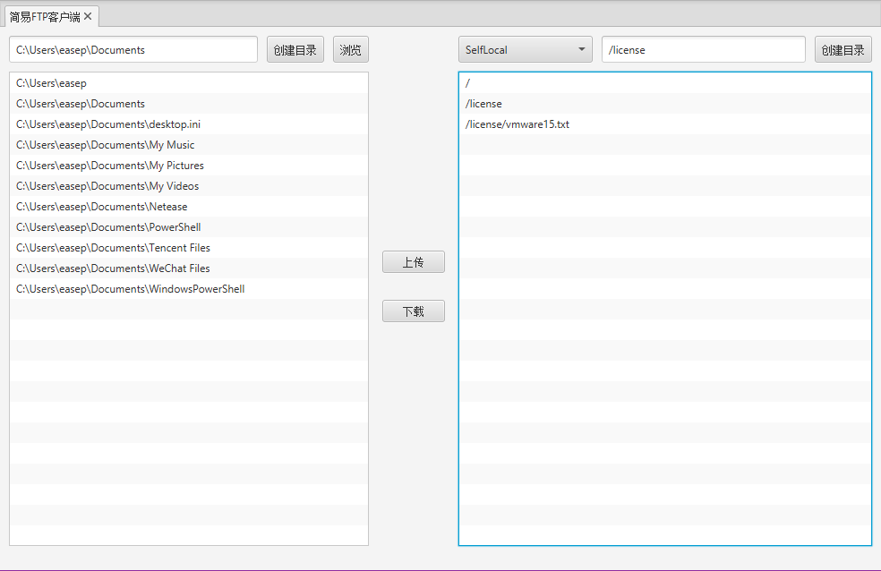

## Ease FTP Client

一个小而简、功能全的WeTool FTP插件

最新版下载地址：[wetool-plugin-ftpclient-1.2.0.jar](http://share.qiniu.easepan.xyz/tool/wetool/plugin/wetool-plugin-ftpclient-1.2.0.jar)

### 配置说明

在WeTool工作目录的`conf`目录下新增`ftp-client-config.json`文件，并配置至少一个`ftp`服务器，插件即可正常加载

```json
{
    /*初始化时是否打开选项卡*/
    "showOnStartup": false,
    "ftps": [
        {
            /*FTP连接名称*/
            "name": "EaseFtp",
            "host": "127.0.0.1",
            "port": 21,
            "anonymous": false,
            "username": "root",
            "password": "root",
            "charset": "utf-8",
            /*是否为默认FTP*/
            "select": true,
            /*是否懒连接*/
            "lazyConnect": true
        }
    ]
}
```

### 运行截图



### 历史更新

#### [v1.2.0](http://share.qiniu.easepan.xyz/tool/wetool/plugin/wetool-plugin-ftpclient-1.2.0.jar)

- 更新WeTool版本

#### [v1.1.2](http://share.qiniu.easepan.xyz/tool/wetool/plugin/wetool-plugin-ftpclient-1.1.2.jar)

- 更新WeTool版本

#### [v1.1.1](http://share.qiniu.easepan.xyz/tool/wetool/plugin/wetool-plugin-ftpclient-1.1.1.jar)

- 更新WeTool版本

#### [v1.1.0](http://share.qiniu.easepan.xyz/tool/wetool/plugin/wetool-plugin-ftpclient-1.1.0.jar)

- 更新WeTool版本

#### [v1.0.2](http://share.qiniu.easepan.xyz/tool/wetool/plugin/wetool-plugin-ftpclient-1.0.2.jar)

- 迁移配置文件路径
- 更新WeTool版本

#### [v1.0.1](http://share.qiniu.easepan.xyz/tool/wetool/plugin/wetool-plugin-ftpclient-1.0.1.jar)

- 优化样式
- 更新至WeTool版本

#### [v1.0.0](http://share.qiniu.easepan.xyz/tool/wetool/plugin/wetool-plugin-ftp-1.0.0.jar)

- 多FTP配置
- 创建目录，上传下载，删除文件
- 复制文件链接
