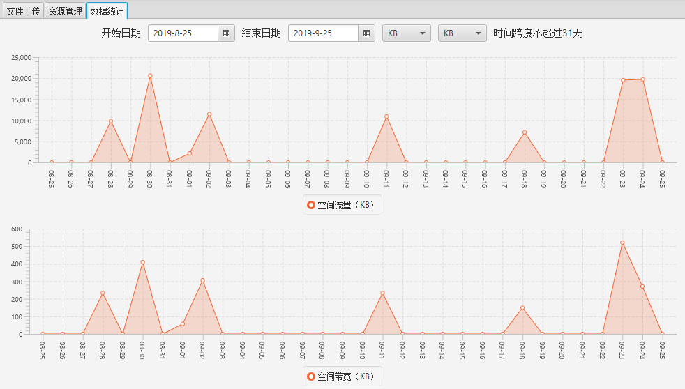

## Ease Qiniu

一个可以管理七牛云对象存储的WeTool插件

最新版下载地址：[wetool-plugin-qiniu-1.0.1.jar](http://share.qiniu.segocat.com/tool/wetool/plugin/wetool-plugin-qiniu-1.0.1.jar)

> 第一次运行时，先重置密钥，然后添加存储空间（Bucket）即可。

### 运行截图

文件上载

资源管理

数据统计

### 历史更新

#### [v1.0.1](http://share.qiniu.segocat.com/tool/wetool/plugin/wetool-plugin-qiniu-1.0.1.jar)

- 更新WeTool版本
- 支持WeToo菜单打开文件

#### [v1.0.0](http://share.qiniu.segocat.com/tool/wetool/plugin/wetool-plugin-qiniu-1.0.0.jar)

- 文件的上传下载，删除，重命名
- 移动、复制，刷新文件
- 设置文件生存时长
- 创建目录，上传下载，删除文件
- 复制文件链接
- 操作日志下载
- 正则表达式搜索文件
- 流量图表统计
